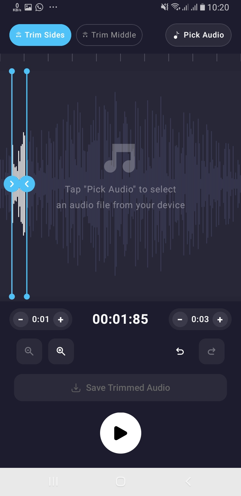
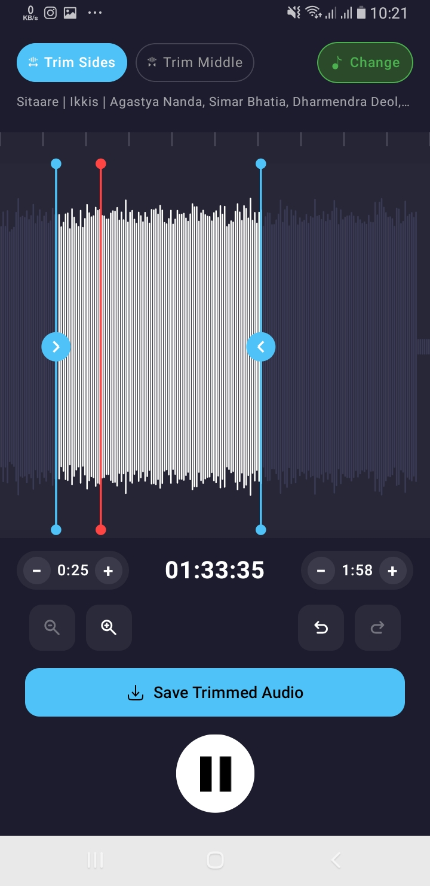

# 🎵 Audio Trimmer – Android Assignment

A modern audio trimming application built using **Jetpack Compose** with a clean architecture approach. Users can import audio files, visualize waveform data, preview playback, trim audio segments, and save trimmed output directly to device storage.

Designed with performance, scalability, and maintainability in mind.

---

## ✨ Features

- 🎵 Pick audio from device storage
- 📊 Real waveform visualization
- ▶️ Audio playback preview
- ✂️ Trim audio using draggable handles
- 🔁 Trim Side mode
- 🎯 Middle trim support structure
- 💾 Save trimmed audio into public device storage
- 📱 Modern Jetpack Compose UI
- ⚡ Smooth state handling
- 🔄 Undo / Redo support
- 🎚 Zoom controls
- 📂 Runtime permission handling
- 🌊 Waveform loading skeleton
- 📣 Snackbar feedback system

---

## 📸 UI Preview

<p align="center">





</p>

---

# 🏗 Architecture

Project follows separation of concerns:

```text
UI Layer
   ↓
ViewModel
   ↓
AudioTrimmerManager
   ↓
Media3 Transformer
   ↓
Device Public Storage
```

The business logic is isolated from UI to improve readability and maintainability.

---

---

# 🚀 Technologies Used

| Technology | Purpose |
|---|---|
| Kotlin | Main language |
| Jetpack Compose | Declarative UI |
| ViewModel | State management |
| StateFlow | Reactive updates |
| Coroutines | Background work |
| Media3 Transformer | Audio trimming |
| MediaPlayer | Audio preview |
| SVG Vector Assets | Lightweight icons |
| WEBP images | Smaller APK size |
| Activity Result APIs | File picker |
| Material3 | UI Components |

---

# 🎯 Why Media3 Transformer?

Google recommends Media3 as the modern media framework.

Reasons:

- Official Android solution
- Hardware accelerated processing
- Better future support
- Cleaner API
- Handles clipping efficiently
- Supports both audio and video workflows
- Easier than manual MediaExtractor + MediaMuxer implementations

The trimming process uses:

```kotlin
MediaItem.ClippingConfiguration
```

to define:

```kotlin
startPositionMs
endPositionMs
```

---

# 🧠 Why ViewModel?

ViewModel was intentionally used because:

### Survives configuration changes

The audio state remains safe during:

- Rotation
- Recomposition
- Activity recreation

### Handles async work cleanly

Operations like:

- waveform extraction
- trimming
- file saving

run inside coroutines using:

```kotlin
viewModelScope.launch{}
```

instead of directly placing logic inside composables.

This keeps UI lightweight.

---

# 🎵 AudioTrimmerManager Responsibilities

The AudioTrimmerManager acts as a single source for audio operations.

Responsibilities:

- Read audio metadata
- Generate waveform data
- Handle trim operations
- Save files to storage
- Return success/error states

Keeping media logic outside UI follows clean architecture principles.

---

# 🎨 UI Approach

UI built entirely with:

Jetpack Compose + Material3

Features:

- State driven UI
- Animated interactions
- Custom Canvas waveform rendering
- SVG icons
- Responsive layouts
- Dark themed editor UI
- Reusable composables

---

# 📦 Optimization Decisions

Several optimizations were used:

### SVG icons

Used vector assets instead of PNG:

Benefits:

- Smaller size
- Sharp on every resolution
- Easily tintable

---

### WEBP images

Used WEBP over PNG/JPG:

Benefits:

- Better compression
- Reduced APK size
- Faster loading
- Higher visual quality

---

# 🧹 Clean Code Practices Followed

✔ Separation of concerns

✔ Single responsibility principle

✔ State hoisting

✔ Reusable composables

✔ Minimal UI logic

✔ Coroutines for background work

✔ Clear naming conventions

✔ Error handling

✔ Snackbar feedback

✔ Avoided hardcoded values where possible

✔ Modular structure

---

# 🔮 Future Improvements

Potential enhancements:

- Complete middle trim implementation
- Audio effects
- Fade in/out
- Share trimmed audio
- Background processing
- Drag waveform scrolling
- Export quality selection
- Multi-track support
- Waveform caching
- Unit tests
- UI tests

---

# ⚙️ Setup

Clone repository:

```bash
git clone https://github.com/iam-mudassirkhan/Video_Downloader_UI_Task_JetpackCompose
```

Open project:

```bash
Open Android Studio
Sync Gradle
Run App
```

---

# 👨‍💻 Developed By

Mudassir Khan

Android Developer

Built as an Android audio trimming assignment using modern Android development practices.
